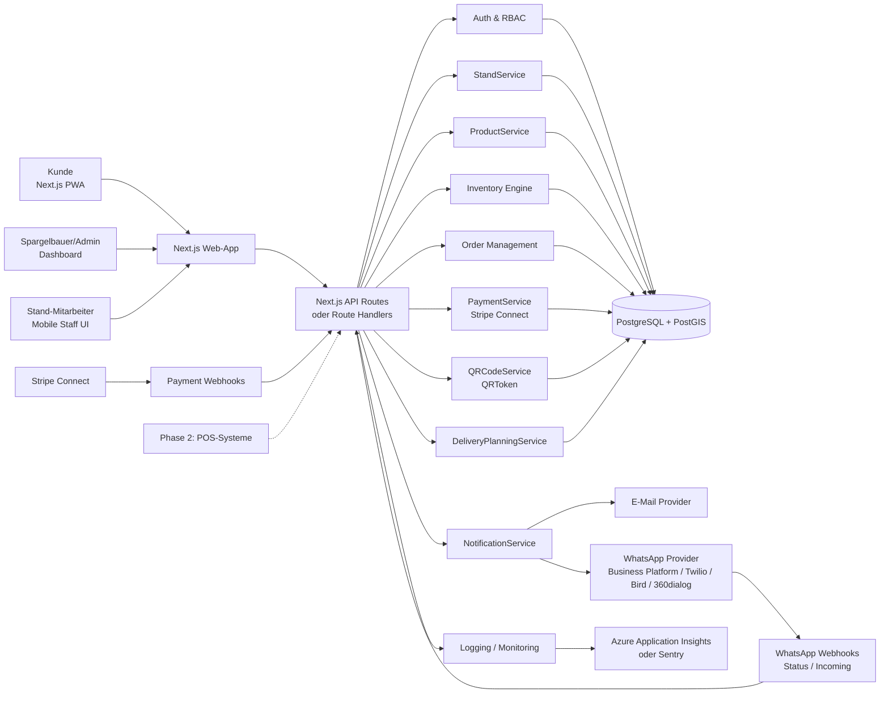

# Technische Architektur

Die MVP-Architektur ist ein modularer Web-App-Ansatz: eine Next.js-Anwendung mit TypeScript bildet Kunden-App, Admin-Dashboard, Mitarbeiteransicht und API-Schicht ab. Die Domainlogik liegt serverseitig in klar getrennten Services. PostgreSQL mit Prisma ist die zentrale Datenquelle.

Diese Architektur ist bewusst einfach gehalten, aber so strukturiert, dass ein späterer Wechsel einzelner Module in ein separates NestJS-Backend möglich bleibt.

## Architekturdiagramm



## Frontend

| Bereich | Umsetzung |
| --- | --- |
| Kunde | Next.js PWA mit Standortsuche, Standdetail, Reservierungsflow, Checkout-Redirect und QR-Code-Anzeige |
| Admin | Geschützter Dashboard-Bereich für Produzentenverwaltung, Bestände, Reservierungen und Lieferempfehlungen |
| Stand-Mitarbeiter | Mobile-first Oberfläche für offene Bestellungen, QR-Scan, Bestandsupdates und Out-of-Stock |
| Gemeinsame Komponenten | Produktkarten, Status-Badges, Mengenwahl, PickupSlot-Auswahl, Tabellen, QR-Anzeige |

Die Web-App soll responsive und installierbar sein. Eine native App ist im MVP nicht notwendig.

## Backend/API

Für das MVP reicht ein modularer Backend-Layer in Next.js API Routes oder Route Handlers. Wichtig ist, die Domainlogik nicht in UI-Komponenten zu platzieren, sondern in Services unter einer serverseitigen Schicht.

Empfohlene Modulgrenzen:

| Modul | Verantwortung |
| --- | --- |
| AuthService | Session, Rollen, Ressourcenbesitz |
| StandService | Standorte, Öffnungszeiten, Status, Geo-Suche |
| ProductService | Produktkatalog, Preise, Sichtbarkeit |
| InventoryService | Bestandsberechnung, Blockierung, Events |
| ReservationService | Order-Statusmodell, Abholzeitfenster, Storno |
| PaymentService | Stripe Checkout/Payment Intent, Webhooks, Refunds |
| QRCodeService | Token-Erstellung, Hashing, QR-Code-Generierung, Validierung |
| DeliveryPlanningService | Regelbasierte Lieferempfehlungen |
| NotificationService | Transaktionale Benachrichtigungen per E-Mail, Push später und WhatsApp |

Ein separates NestJS-Backend ist sinnvoll, wenn mehrere Frontends, mehrere Teams, komplexe Integrationen oder hohe Hintergrundverarbeitungsanteile entstehen. Für den ersten MVP ist ein modularer Next.js-Monolith schneller und ausreichend.

## Datenbank

PostgreSQL ist die zentrale relationale Datenbank. Prisma ORM verwaltet Schema, Migrationen und typisierte Queries. Für Standortsuche wird PostGIS empfohlen. Falls PostGIS im Hosting-Setup verzögert, kann der MVP zunächst mit Latitude/Longitude und Bounding-Box/Radiusberechnung starten.

Wichtige technische Regeln:

| Regel | Umsetzung |
| --- | --- |
| Reservierungen und Bestand atomar ändern | Datenbanktransaktion mit Row-Level Locking oder optimistischem Concurrency Check |
| Payment Webhooks idempotent verarbeiten | Provider Event ID speichern |
| QRToken nicht im Klartext speichern | Token-Hash persistieren |
| Statusübergänge kontrollieren | Nur Domain Services ändern Order- und Payment-Status |
| Auditierbarkeit | InventoryEvent und Audit Logs für kritische Änderungen |

## Authentifizierung

Mögliche Auth-Lösungen sind Auth.js, Supabase Auth oder Auth0. Entscheidend ist, dass Sessions/JWT serverseitig geprüft werden und Rollen nicht aus Client-State vertraut werden.

Empfohlene MVP-Variante:

| Entscheidung | Begründung |
| --- | --- |
| E-Mail-Login plus Passwort oder Magic Link | Niedrige Einstiegshürde für Pilot |
| Serverseitige Session-Prüfung | Schutz für API und Dashboard |
| Rollen in eigener User-Tabelle spiegeln | Unabhängig vom Auth-Provider nutzbar |
| Staff-Zuordnung über Stand-Relation | Mitarbeiter dürfen nur eigene Stände sehen |

## Rollenrechte

RBAC wird in jedem API-Handler durchgesetzt. Die Prüfung besteht aus:

1. Ist der Nutzer authentifiziert?
2. Hat der Nutzer die erforderliche Rolle?
3. Gehört die angefragte Ressource zum erlaubten Scope?
4. Ist der Statusübergang für diese Rolle erlaubt?

Details stehen in [Rollen und Rechte](03-user-roles-and-permissions.md).

## Payment Provider

Stripe Connect ist primärer Payment Provider. Das Modell unterstützt Plattformgebühren, Produzentenauszahlungen und getrennte Payment-Konten. PayPal bleibt optional für Phase 2.

MVP-Zahlungsfluss:

1. Order wird als `pending_payment` erstellt.
2. Payment wird mit Status `pending` gespeichert.
3. Stripe Checkout oder Payment Element wird gestartet.
4. Stripe Webhook bestätigt Zahlung.
5. Payment wird `succeeded`.
6. Order wird `confirmed`.
7. QRToken wird erzeugt.

## QR-Code-Service

Der QR-Code-Service erzeugt QRToken für Stand-QR-Codes und Bestell-QR-Codes. Bestell-QRToken sind signiert, gehasht gespeichert, zeitlich begrenzt und nur einmal verwendbar.

QR-Codes enthalten keine sensiblen Daten. Der QR-Code verweist auf eine URL mit Token, zum Beispiel:

```text
https://app.example.com/pickup/scan?token=<signed-token>
```

## Inventory Engine

Die Inventory Engine ist für die Reservierungsgarantie zentral. Sie berechnet:

```text
available_quantity = stock_quantity - reserved_quantity - safety_buffer
```

Sie blockiert Mengen während `pending_payment`, hält sie für `confirmed` reserviert und reduziert den physischen Bestand bei `picked_up`.

## Order Management

Das Order Management verwaltet den Status:

```text
draft -> pending_payment -> confirmed -> ready_for_pickup -> picked_up
```

Fehler- und Sonderpfade:

```text
pending_payment -> expired
pending_payment -> cancelled
pending_payment -> payment failed -> cancelled oder expired
confirmed -> cancelled
confirmed -> refunded
```

Zulässige Statuswerte sind: `draft`, `pending_payment`, `confirmed`, `ready_for_pickup`, `picked_up`, `cancelled`, `expired`, `refunded`.

## Notification Service und WhatsApp Provider

Der Notification Service ist eine eigene Backend-Komponente für transaktionale Benachrichtigungen. Er wird durch Order Events ausgelöst und unterstützt im MVP E-Mail sowie WhatsApp als optionalen P1-Pilotkanal. Push bleibt vorbereitet, aber nicht MVP-kritisch.

Verantwortung:

| Aufgabe | MVP-Umsetzung |
| --- | --- |
| Events verarbeiten | `order.confirmed`, `payment.succeeded`, `pickup.reminder_due`, `order.ready_for_pickup`, `order.changed`, `order.picked_up`, `order.cancelled` |
| Kanal wählen | Nutzerpräferenz, Opt-in und Fallback-Regeln prüfen |
| WhatsApp versenden | Genehmigte Message Templates über WhatsApp Business Platform oder Provider nutzen |
| QR-Link bereitstellen | Nur sicheren Link zur Bestellung oder QR-Code-Seite versenden |
| Versandstatus speichern | Notification-Eintrag mit `pending`, `sent`, `delivered`, `failed` oder `cancelled` |
| Fehler sichtbar machen | Fehlgeschlagene Nachrichten für Admins und Plattformadmin auswertbar machen |

Logischer Ablauf:

```text
Order Management
    ↓
Order Event
    ↓
Notification Service
    ↓
WhatsApp Provider
    ↓
Kunde
```

WhatsApp ist im MVP ein Bestellbegleiter. Reservierung, Zahlung und QR-Abholung bleiben App/PWA-Funktionen. Eingehende WhatsApp-Nachrichten und vollständige Bestellung per WhatsApp werden nur technisch vorbereitet und erst in späteren Phasen produktiv ausgebaut.

### WhatsApp Provider Integration

Die Integration kann direkt über die WhatsApp Business Platform / Cloud API oder über Provider wie Twilio, Bird/MessageBird oder 360dialog erfolgen. Für proaktive Nachrichten müssen genehmigte Message Templates genutzt werden.

MVP-Anforderungen:

1. Provider-Zugang und Sandbox/Staging konfigurieren.
2. Template-Keys für Bestellbestätigung, Zahlungsbestätigung, Abholerinnerung, Statusänderung und Abholabschluss dokumentieren.
3. Delivery-Status-Webhooks idempotent verarbeiten.
4. Eingehende Nachrichten-Webhooks vorbereiten, aber im MVP nicht als Chatbot nutzen.
5. Provider-IDs und Fehler ohne unnötige personenbezogene Daten speichern.

## Admin-Dashboard

Das Admin-Dashboard ist Teil der Next.js-App und nutzt dieselbe API. Es fokussiert operative Steuerung:

| Seite | Zweck |
| --- | --- |
| Dashboard | Tagesüberblick, offene Abholungen, kritische Bestände |
| Stände | Standortdaten, Öffnungszeiten, Status |
| Produkte | Sortiment, Preise, Einheiten |
| Bestand | Manuelle Bestandsupdates und Sicherheitsbestand |
| Reservierungen | Bestellungen, Status, Abholfenster |
| Benachrichtigungen | Versandstatus, fehlgeschlagene Nachrichten und Opt-in-Sicht |
| Lieferplanung | Regelbasierte Empfehlungen |
| Umsätze | Digitaler Umsatz, Service Fees, Payment-Status |
| Mitarbeiter | Rollen und Stand-Zuordnung |

## Spätere POS-Integration

POS-Integration ist Phase 2. Die Architektur bereitet sie über InventoryEvent und klare Servicegrenzen vor. Ein POS-Adapter würde später externe Verkäufe als InventoryEvents importieren und `stock_quantity` synchronisieren.

## Skalierbarkeit und saisonale Nutzung

Die App hat saisonale Lastspitzen. Für das MVP reicht horizontale Skalierung der Web-App plus eine robuste PostgreSQL-Instanz.

| Thema | MVP-Ansatz |
| --- | --- |
| Saisonstart | Stände und Produkte vorab konfigurieren |
| Tageslast | Caching für öffentliche Stand- und Produktdaten, aber keine Cache-Nutzung für Reservierungsprüfung |
| Checkout-Spitzen | Idempotente Payment- und Order-Logik |
| QR-Scan am Stand | Kleine, schnelle API-Antworten und manueller Fallback-Code |
| Datenwachstum | Indizes auf `stand_id`, `producer_id`, `status`, `pickup_slot_start`, Geo-Spalten |
