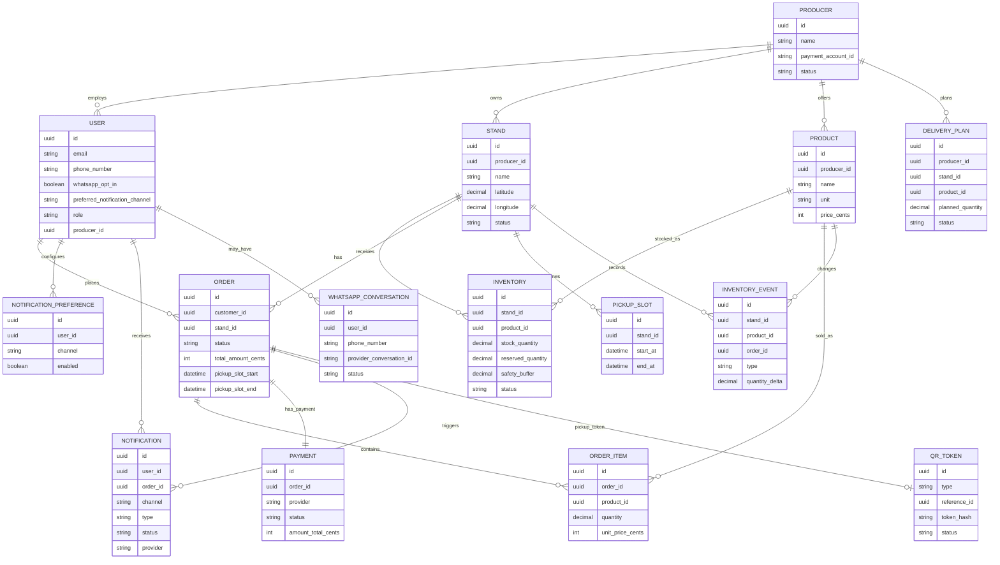

# Datenmodell

Das Datenmodell bildet den garantierten Reservierungsflow ab: Produktbestand wird je Stand geführt, Reservierungen blockieren Mengen, Zahlungen bestätigen Bestellungen und QRToken sichern die Abholung.

## High-Level-Datenmodell

| Entität | Zweck |
| --- | --- |
| User | Authentifizierter Nutzer mit Rolle |
| Producer | Landwirtschaftlicher Betrieb |
| Stand | Physischer Verkaufsstand |
| Product | Produkt des Produzenten |
| Inventory / StandProduct | Bestand und Verfügbarkeitsstatus eines Produkts an einem Stand |
| Order / Reservation | Reservierung und Bestellung eines Kunden |
| OrderItem | Position innerhalb einer Reservierung |
| Payment | Zahlungsstatus, Provider-IDs und Gebühren |
| QRToken | Signierter, gehashter Token für Stand- oder Bestell-QR-Codes |
| Notification | Versandauftrag und Versandstatus für E-Mail, WhatsApp oder Push |
| NotificationPreference | Kanalpräferenzen und Opt-in/Opt-out je Nutzer |
| InventoryEvent | Nachvollziehbare Bestandsänderung |
| PickupSlot | Abholzeitfenster je Stand |
| DeliveryPlan | Manuelle oder regelbasierte Lieferplanung |
| WhatsAppConversation | Optional für spätere eingehende WhatsApp-Unterhaltungen |

## User

| Feld | Typ | Beschreibung |
| --- | --- | --- |
| id | uuid | Eindeutige User-ID |
| name | string | Anzeigename |
| email | string | E-Mail-Adresse, eindeutig |
| phone_number | string? | Optionale Telefonnummer im normalisierten Format |
| phone_verified_at | datetime? | Zeitpunkt der Telefonverifikation |
| whatsapp_opt_in | boolean | Aktive Einwilligung für WhatsApp-Benachrichtigungen |
| whatsapp_opt_in_at | datetime? | Zeitpunkt der WhatsApp-Einwilligung |
| whatsapp_opt_out_at | datetime? | Zeitpunkt der WhatsApp-Deaktivierung |
| preferred_notification_channel | enum? | `email`, `whatsapp` oder `push` |
| role | enum | `customer`, `producer_admin`, `staff`, `platform_admin` |
| producer_id | uuid? | Zugehöriger Produzent für Admins und Mitarbeiter |
| active | boolean | Login und Zugriff erlaubt |
| created_at | datetime | Erstellungszeitpunkt |
| updated_at | datetime | Letzte Änderung |

## Producer

| Feld | Typ | Beschreibung |
| --- | --- | --- |
| id | uuid | Produzent-ID |
| name | string | Hof, Betrieb oder Marke |
| legal_name | string? | Rechtlicher Name für Abrechnung |
| billing_email | string? | Kontakt für Rechnungen |
| payment_account_id | string? | Stripe Connected Account ID |
| status | enum | `active`, `paused`, `disabled` |
| service_fee_config | json | Gebührenkonfiguration je Pilotmodell |
| created_at | datetime | Erstellungszeitpunkt |
| updated_at | datetime | Letzte Änderung |

## Stand

| Feld | Typ | Beschreibung |
| --- | --- | --- |
| id | uuid | Stand-ID |
| producer_id | uuid | Zugehöriger Produzent |
| name | string | Name, z. B. `Stand Mannheim Ost` |
| address_line | string | Adresse |
| postal_code | string | Postleitzahl |
| city | string | Ort |
| latitude | decimal | Breitengrad |
| longitude | decimal | Längengrad |
| geo_point | geography? | Optionaler PostGIS-Punkt |
| opening_hours | json | Öffnungszeiten je Wochentag |
| status | enum | `open`, `closed`, `seasonal_pause` |
| public_note | string? | Kurzer Hinweis für Kunden |
| created_at | datetime | Erstellungszeitpunkt |
| updated_at | datetime | Letzte Änderung |

## Product

| Feld | Typ | Beschreibung |
| --- | --- | --- |
| id | uuid | Produkt-ID |
| producer_id | uuid | Zugehöriger Produzent |
| name | string | Produktname, z. B. `Spargel Klasse I` |
| category | string | Spargel, Erdbeeren, Kartoffeln usw. |
| unit | string | kg, Schale, Bund, Stück |
| price_cents | integer | Preis je Einheit in Cent |
| currency | string | Standard `EUR` |
| active | boolean | Sichtbar und nutzbar |
| description | string? | Kurze Produktbeschreibung |
| created_at | datetime | Erstellungszeitpunkt |
| updated_at | datetime | Letzte Änderung |

## Inventory / StandProduct

| Feld | Typ | Beschreibung |
| --- | --- | --- |
| id | uuid | Inventory-Zeile |
| stand_id | uuid | Zugehöriger Stand |
| product_id | uuid | Zugehöriges Produkt |
| stock_quantity | decimal | Gemeldeter physischer Bestand |
| reserved_quantity | decimal | Durch Orders geblockte Menge |
| safety_buffer | decimal | Sicherheitsbestand |
| low_stock_threshold | decimal | Schwelle für `low_stock` |
| status | enum | `available`, `low_stock`, `out_of_stock`, `next_delivery_expected` |
| next_delivery_at | datetime? | Erwartete Nachlieferung |
| updated_by_user_id | uuid? | Letzte manuelle Änderung |
| updated_at | datetime | Letzte Änderung |

Berechnete Größe:

```text
available_quantity = stock_quantity - reserved_quantity - safety_buffer
```

## Order / Reservation

| Feld | Typ | Beschreibung |
| --- | --- | --- |
| id | uuid | Order-ID |
| order_number | string | Kurzer lesbarer Code für Support und Fallback |
| customer_id | uuid | Kunde |
| producer_id | uuid | Denormalisiert für RBAC und Reporting |
| stand_id | uuid | Abholstand |
| pickup_slot_id | uuid? | Gewähltes Zeitfenster |
| pickup_slot_start | datetime | Start des Abholfensters |
| pickup_slot_end | datetime | Ende des Abholfensters |
| status | enum | `draft`, `pending_payment`, `confirmed`, `ready_for_pickup`, `picked_up`, `cancelled`, `expired`, `refunded` |
| product_total_cents | integer | Warenwert |
| service_fee_cents | integer | Service Fee |
| total_amount_cents | integer | Gesamtbetrag |
| currency | string | Standard `EUR` |
| expires_at | datetime? | Ablauf temporärer Reservierung |
| picked_up_at | datetime? | Zeitpunkt der Abholung |
| cancelled_at | datetime? | Zeitpunkt der Stornierung |
| created_at | datetime | Erstellungszeitpunkt |
| updated_at | datetime | Letzte Änderung |

## OrderItem

| Feld | Typ | Beschreibung |
| --- | --- | --- |
| id | uuid | OrderItem-ID |
| order_id | uuid | Zugehörige Order |
| product_id | uuid | Produkt |
| stand_product_id | uuid | Inventory-Zeile, die reserviert wurde |
| quantity | decimal | Menge |
| unit | string | Einheit zum Kaufzeitpunkt |
| unit_price_cents | integer | Preis je Einheit zum Kaufzeitpunkt |
| total_price_cents | integer | Positionssumme |

## Payment

| Feld | Typ | Beschreibung |
| --- | --- | --- |
| id | uuid | Payment-ID |
| order_id | uuid | Zugehörige Order |
| provider | enum | `stripe`, später optional `paypal` |
| provider_payment_id | string? | Payment Intent, Checkout Session oder Order ID |
| provider_event_id | string? | Letztes verarbeitetes Webhook-Event |
| status | enum | `pending`, `succeeded`, `failed`, `refunded` |
| amount_total_cents | integer | Gesamtbetrag |
| product_amount_cents | integer | Warenwert |
| service_fee_cents | integer | Plattform-Service-Fee |
| provider_fee_cents | integer? | Payment-Gebühr, falls verfügbar |
| payout_status | enum? | `pending`, `succeeded`, `failed` |
| refunded_amount_cents | integer | Bisher erstatteter Betrag |
| created_at | datetime | Erstellungszeitpunkt |
| updated_at | datetime | Letzte Änderung |

## Notification

| Feld | Typ | Beschreibung |
| --- | --- | --- |
| id | uuid | Notification-ID |
| user_id | uuid | Empfänger |
| order_id | uuid? | Zugehörige Order, falls bestellbezogen |
| channel | enum | `email`, `whatsapp`, `push` |
| type | enum | `order_confirmed`, `payment_confirmed`, `pickup_reminder`, `order_ready`, `order_changed`, `picked_up` |
| template_key | string | Interner Template-Schlüssel, z. B. `whatsapp.order_confirmed.v1` |
| recipient | string | Empfängeradresse oder normalisierte Telefonnummer |
| status | enum | `pending`, `sent`, `delivered`, `failed`, `cancelled` |
| provider | string | Versandprovider, z. B. `sendgrid`, `whatsapp_cloud`, `twilio`, `360dialog` |
| provider_message_id | string? | Externe Nachrichten-ID |
| error_message | string? | Gekürzte Fehlerbeschreibung ohne sensible Rohpayload |
| scheduled_at | datetime? | Geplanter Versandzeitpunkt |
| sent_at | datetime? | Versandzeitpunkt |
| delivered_at | datetime? | Zustellzeitpunkt |
| created_at | datetime | Erstellungszeitpunkt |

## NotificationPreference

| Feld | Typ | Beschreibung |
| --- | --- | --- |
| id | uuid | Preference-ID |
| user_id | uuid | Nutzer |
| channel | enum | `email`, `whatsapp`, `push` |
| enabled | boolean | Kanal aktiviert |
| created_at | datetime | Erstellungszeitpunkt |
| updated_at | datetime | Letzte Änderung |

## WhatsAppConversation

Optional für spätere Phasen, wenn eingehende WhatsApp-Nachrichten, Statusabfragen oder Conversational Commerce umgesetzt werden.

| Feld | Typ | Beschreibung |
| --- | --- | --- |
| id | uuid | Conversation-ID |
| user_id | uuid? | Verknüpfter Nutzer, falls bekannt |
| phone_number | string | Telefonnummer der Unterhaltung |
| provider_conversation_id | string? | Provider-Referenz |
| last_message_at | datetime? | Zeitpunkt der letzten Nachricht |
| status | enum | `open`, `closed`, `archived` |

## QRToken

| Feld | Typ | Beschreibung |
| --- | --- | --- |
| id | uuid | QRToken-ID |
| type | enum | `stand`, `stand_product`, `order`, `staff` |
| reference_id | uuid | Stand-, Product- oder Order-ID |
| token_hash | string | Hash des signierten Tokens |
| expires_at | datetime? | Ablaufzeitpunkt |
| used_at | datetime? | Zeitpunkt der Nutzung |
| used_by_user_id | uuid? | Mitarbeiter, der den Token verwendet hat |
| status | enum | `active`, `used`, `expired`, `revoked` |
| created_at | datetime | Erstellungszeitpunkt |

## InventoryEvent

| Feld | Typ | Beschreibung |
| --- | --- | --- |
| id | uuid | Event-ID |
| stand_id | uuid | Stand |
| product_id | uuid | Produkt |
| order_id | uuid? | Optionale Order-Verknüpfung |
| type | enum | `manual_update`, `reservation_hold`, `reservation_release`, `pickup`, `cancellation`, `delivery`, `correction`, `out_of_stock` |
| quantity_delta | decimal | Mengenänderung |
| stock_after | decimal | Bestand nach Änderung |
| reserved_after | decimal | Reservierte Menge nach Änderung |
| actor_id | uuid? | Auslösender User |
| note | string? | Begründung |
| created_at | datetime | Zeitpunkt |

## PickupSlot

| Feld | Typ | Beschreibung |
| --- | --- | --- |
| id | uuid | PickupSlot-ID |
| stand_id | uuid | Stand |
| start_at | datetime | Beginn |
| end_at | datetime | Ende |
| capacity_orders | integer? | Optionale maximale Anzahl Bestellungen |
| active | boolean | Slot buchbar |
| created_at | datetime | Erstellungszeitpunkt |

## DeliveryPlan

| Feld | Typ | Beschreibung |
| --- | --- | --- |
| id | uuid | DeliveryPlan-ID |
| producer_id | uuid | Produzent |
| stand_id | uuid | Zielstand |
| product_id | uuid | Produkt |
| planned_quantity | decimal | Geplante Liefermenge |
| recommended_quantity | decimal? | Systemempfehlung |
| planned_arrival_at | datetime | Geplante Ankunft |
| status | enum | `planned`, `in_transit`, `delivered`, `cancelled` |
| created_by_user_id | uuid | Admin |
| created_at | datetime | Erstellungszeitpunkt |
| updated_at | datetime | Letzte Änderung |

## Beziehungen

| Beziehung | Kardinalität |
| --- | --- |
| Producer -> Stand | 1:n |
| Producer -> Product | 1:n |
| Producer -> User | 1:n für Admins und Mitarbeiter |
| Stand -> Inventory | 1:n |
| Product -> Inventory | 1:n |
| Stand -> PickupSlot | 1:n |
| User(customer) -> Order | 1:n |
| Stand -> Order | 1:n |
| Order -> OrderItem | 1:n |
| Order -> Payment | 1:1 im MVP |
| Order -> QRToken | 1:1 für Bestell-QR |
| User -> NotificationPreference | 1:n |
| User -> Notification | 1:n |
| Order -> Notification | 1:n |
| User -> WhatsAppConversation | 1:n optional |
| Stand/Product/Order -> QRToken | 1:n je Typ möglich |
| Inventory -> InventoryEvent | 1:n über `stand_id` und `product_id` |
| DeliveryPlan -> InventoryEvent | Indirekt über Lieferung |

## Mermaid ER-Diagramm



## Hinweise für Prisma-Schema-Umsetzung

| Thema | Empfehlung |
| --- | --- |
| IDs | `String @id @default(uuid())` oder native UUIDs nutzen |
| Geldbeträge | Immer Integer in Cent speichern |
| Mengen | Decimal verwenden, da kg und Schalen unterschiedliche Genauigkeit brauchen |
| Enums | Order-, Payment-, Inventory- und Stand-Status als Prisma Enums |
| Geo | PostGIS kann über SQL-Migrationen ergänzt werden; Prisma verwaltet einfache Lat/Lng-Felder |
| Unique Constraints | `User.email`, `Payment.provider_event_id`, `Order.order_number`, `Inventory(stand_id, product_id)` |
| Unique Constraints Benachrichtigungen | Optional `Notification.provider_message_id`, `NotificationPreference(user_id, channel)` |
| Indizes | `producer_id`, `stand_id`, `status`, `pickup_slot_start`, `created_at`, `Notification(order_id, channel, status)`, `Notification(scheduled_at)` |
| Transaktionen | Reservierung und Bestandsblockierung immer gemeinsam ausführen |
| Soft Deletes | Für Stände/Produkte lieber `active`/`status` statt hartem Löschen |
| Auditing | Kritische Änderungen zusätzlich in `InventoryEvent`, `Notification` oder Audit Log erfassen |
| Telefonnummern | Normalisiert speichern, Zugriff minimieren und für WhatsApp nur bei aktivem Opt-in nutzen |
