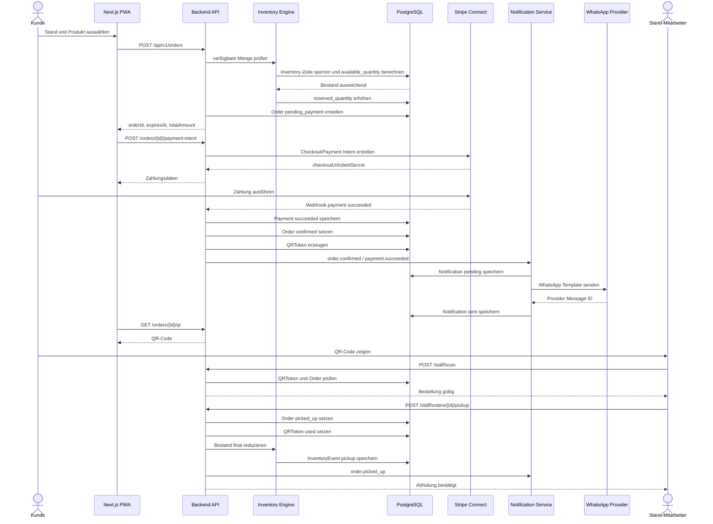

# Reservierung, Zahlung und Abholung

Der End-to-End-Prozess ist der wichtigste technische und operative Ablauf des MVP. Er stellt sicher, dass eine reservierte und bezahlte Ware bei Abholung vorhanden ist.

## End-to-End-Prozess

1. Kunde öffnet die App.
2. App ermittelt Standort oder nutzt manuelle Suche.
3. Kunde findet nahe Stände.
4. Kunde öffnet Standdetailseite.
5. Kunde wählt Produkt.
6. Kunde wählt Menge.
7. Kunde wählt Abholzeitfenster.
8. Backend prüft verfügbaren Bestand.
9. Backend blockiert Menge temporär.
10. Order wird mit Status `pending_payment` erstellt.
11. Payment wird mit Status `pending` erstellt.
12. Kunde bezahlt digital über Stripe.
13. Stripe sendet Payment Webhook.
14. Backend setzt Payment auf `succeeded`.
15. Backend setzt Order auf `confirmed`.
16. Backend erzeugt QRToken.
17. Order Event löst den Notification Service aus.
18. Bei aktivem WhatsApp Opt-in wird eine Bestellbestätigung mit sicherem Link zur Bestellung oder QR-Code-Seite versendet.
19. Abholerinnerung wird vor dem Zeitfenster geplant.
20. Kunde sieht Bestell-QR-Code in der App/PWA.
21. Kunde kommt im Abholzeitfenster zum Stand.
22. Stand-Mitarbeiter scannt QR-Code oder gibt Fallback-Code ein.
23. Backend validiert QRToken und Bestellung.
24. Mitarbeiter übergibt Ware.
25. Mitarbeiter bestätigt Abholung.
26. Order wird auf `picked_up` gesetzt.
27. QRToken wird als verwendet markiert.
28. Bestand wird final reduziert.
29. InventoryEvent wird gespeichert.
30. Optional wird eine Abholbestätigung per WhatsApp oder E-Mail versendet.

## Mermaid Sequence Diagram



## WhatsApp-Bestellkommunikation

WhatsApp ergänzt den App/PWA-Flow als optionaler Statuskanal. Der Kunde bestellt, bezahlt und öffnet den QR-Code weiterhin in der App/PWA.

```text
Kunde reserviert Produkt
    ↓
Kunde aktiviert WhatsApp Opt-in
    ↓
Kunde bezahlt Bestellung
    ↓
Payment Webhook bestätigt Zahlung
    ↓
Order wird auf Confirmed gesetzt
    ↓
Order Event löst Notification Service aus
    ↓
WhatsApp-Bestätigung wird versendet
    ↓
Abholerinnerung wird vor dem Zeitfenster geplant
    ↓
Kunde erhält Link zur QR-Code-Seite
    ↓
Nach Abholung erhält Kunde optional Abschlussnachricht
```

MVP-Nachrichten sollten auf 2-3 Nachrichten pro Bestellung begrenzt werden:

| Nachricht | Auslöser | MVP-Relevanz |
| --- | --- | --- |
| Bestell-/Zahlungsbestätigung | `payment.succeeded` oder `order.confirmed` | P1 |
| Abholerinnerung mit QR-Link | `pickup.reminder_due` | P1 |
| Abholabschluss oder Statusänderung | `order.picked_up` oder `order.changed` | Optional P1 |

## Statusmodell Order

| Status | Bedeutung | Typischer Auslöser |
| --- | --- | --- |
| `draft` | Bestellung wird vorbereitet, noch keine Blockierung | Optionaler Warenkorb |
| `pending_payment` | Bestand ist temporär blockiert, Zahlung offen | Reservierung erstellt |
| `confirmed` | Zahlung erfolgreich, Ware verbindlich reserviert | Payment Webhook `succeeded` |
| `ready_for_pickup` | Optional durch Mitarbeiter oder System markiert | Ware vorbereitet |
| `picked_up` | Ware wurde abgeholt | Mitarbeiter bestätigt Pickup |
| `cancelled` | Bestellung storniert | Kunde/Admin storniert vor finalem Abschluss |
| `expired` | Reservierung oder Abholfenster abgelaufen | Cronjob oder Timeout |
| `refunded` | Zahlung wurde erstattet | Refund abgeschlossen |

Erlaubte Hauptübergänge:

```text
draft -> pending_payment
pending_payment -> confirmed
pending_payment -> cancelled
pending_payment -> expired
confirmed -> ready_for_pickup
confirmed -> picked_up
ready_for_pickup -> picked_up
confirmed -> cancelled
confirmed -> refunded
picked_up -> refunded
```

## Statusmodell Payment

| Status | Bedeutung | Wirkung auf Order |
| --- | --- | --- |
| `pending` | Zahlung gestartet, Ergebnis offen | Order bleibt `pending_payment` |
| `succeeded` | Zahlung bestätigt | Order wird `confirmed` |
| `failed` | Zahlung fehlgeschlagen | Order wird `cancelled` oder `expired`, Bestand wird freigegeben |
| `refunded` | Zahlung erstattet | Order wird `refunded` |

## Bestandseffekte

| Ereignis | stock_quantity | reserved_quantity |
| --- | --- | --- |
| Order `pending_payment` | Unverändert | Erhöht sich um reservierte Menge |
| Payment `failed` | Unverändert | Verringert sich um reservierte Menge |
| Order `expired` vor Zahlung | Unverändert | Verringert sich um reservierte Menge |
| Order `confirmed` | Unverändert | Bleibt reserviert |
| Order `picked_up` | Verringert sich um abgeholte Menge | Verringert sich um abgeholte Menge |
| Order `cancelled` vor Pickup | Unverändert | Verringert sich um reservierte Menge |

## Edge Cases

### Payment fehlgeschlagen

| Schritt | Systemverhalten |
| --- | --- |
| Stripe meldet Fehler | Payment wird `failed` |
| Order ist `pending_payment` | Order wird `cancelled` oder `expired` |
| Reservierte Menge | Wird freigegeben |
| Kunde | Sieht Fehlermeldung und kann neu starten |

### Kunde bricht Zahlung ab

| Schritt | Systemverhalten |
| --- | --- |
| Kunde kehrt ohne Zahlung zurück | Order bleibt bis `expires_at` in `pending_payment` |
| Timeout erreicht | Cronjob setzt Order auf `expired` |
| Bestand | `reserved_quantity` wird reduziert |

### Reservierung läuft ab

| Schritt | Systemverhalten |
| --- | --- |
| `expires_at` überschritten | Cronjob sucht offene `pending_payment` Orders |
| Order-Status | Wechsel auf `expired` |
| Payment | Bleibt `pending` oder wird bei späterem Webhook idempotent abgelehnt/abgeglichen |
| Bestand | Blockierung wird freigegeben |

### Kunde erscheint nicht

| Schritt | Systemverhalten |
| --- | --- |
| Abholfenster plus Kulanzzeit überschritten | Order kann auf `expired` oder manuell `cancelled` gesetzt werden |
| Zahlung | No-show-Regel entscheidet über Refund |
| Bestand | Ware bleibt physisch vorhanden, Reservierung wird freigegeben oder manuell verarbeitet |
| Audit | Ereignis wird protokolliert |

### Stand kann nicht liefern

| Schritt | Systemverhalten |
| --- | --- |
| Mitarbeiter/Admin meldet Problem | Order wird manuell geprüft |
| Kunde | Erhält volle Erstattung inklusive Service Fee |
| Payment | Payment wird `refunded` |
| Order | Order wird `refunded` |
| Inventory | Korrektur-InventoryEvent dokumentiert Abweichung |
| Kommunikation | Bei WhatsApp Opt-in kann eine Statusänderung über freigegebenes Template versendet werden |

### WhatsApp-Zustellung schlägt fehl

| Schritt | Systemverhalten |
| --- | --- |
| Provider meldet Fehler oder Timeout | Notification wird `failed` |
| Bestellung | Bleibt unverändert und vollständig gültig |
| Kunde | Kann Bestellung und QR-Code weiterhin in App/PWA abrufen |
| Admin | Sieht fehlgeschlagene Nachricht im Notification Log |
| Fallback | E-Mail oder App/PWA bleibt primärer Informationsweg |

### QR-Code wurde bereits verwendet

| Schritt | Systemverhalten |
| --- | --- |
| Mitarbeiter scannt verwendeten Token | API gibt `QR_TOKEN_ALREADY_USED` zurück |
| Order ist `picked_up` | Keine erneute Abholung möglich |
| Anzeige | Staff UI zeigt Zeitpunkt der Verwendung |
| Audit | Fehlversuch wird geloggt |

### Gleichzeitige Reservierungen

| Schritt | Systemverhalten |
| --- | --- |
| Zwei Kunden buchen letzte Menge | Inventory-Zeile wird transaktional geprüft |
| Erste Transaktion erfolgreich | `reserved_quantity` steigt |
| Zweite Transaktion nicht ausreichend | API gibt `INSUFFICIENT_INVENTORY` zurück |

## Operative Regeln

| Regel | Begründung |
| --- | --- |
| Zahlung muss vor QRToken-Erzeugung erfolgreich sein | QR-Code darf keine unbezahlte Ware freigeben |
| QRToken ist One-Time-Use | Verhindert doppelte Abholung |
| WhatsApp ersetzt nicht die App/PWA | Reservierung, Zahlung und QR-Code bleiben im Kernsystem |
| WhatsApp-Link darf keinen unsicheren Roh-Token enthalten | Zugriff nur über signierten, zeitlich begrenzten Link oder authentifizierte Session |
| WhatsApp-Versand ist optional | Bestellung muss ohne WhatsApp vollständig funktionieren |
| Abholung reduziert Bestand final | Reservierung wird erst am Stand physisch abgeschlossen |
| Manuelle Fallback-Codeeingabe ist Pflicht | Schlechter Scanner oder beschädigter QR-Code darf Prozess nicht blockieren |
| Mitarbeiter sieht nur notwendige Kundendaten | DSGVO und Bedienbarkeit |
