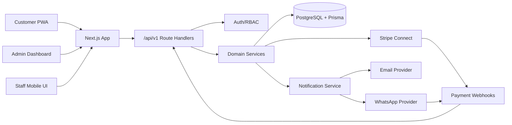

# Architecture Overview

## Zielbild

Die Spargelstand-App startet als modularer Next.js-Monolith. Eine Codebase enthält Customer PWA, Admin-Dashboard, Staff-Ansicht und API Route Handlers. Die fachliche Logik liegt in serverseitigen Services und kann später in ein separates Backend extrahiert werden.

## Modulgrenzen

| Modul | Verantwortung |
| --- | --- |
| Auth/RBAC | Session, Rolle, Producer-Scope, Staff-Stand-Scope |
| Stand/Product | Standort-, Öffnungs- und Produktdaten |
| Inventory | Verfügbarkeit, Blockierung, Freigabe, Pickup, Events |
| Reservation | Order-Erstellung, Statusmodell, Storno, Ablauf |
| Payment | Stripe Checkout/Payment Intent, Webhooks, Refund-Skeleton |
| QR | Signierte Tokens, Hash, QR-Link, Scan-Validierung |
| Notification | E-Mail/WhatsApp-Versandaufträge, Status und Fehler |
| Delivery | Regelbasierte Lieferempfehlungen |

## Transaktionsgrenzen

Transaktionen sind Pflicht für Reservierung, Payment Success, Payment Failure/Expiry, Pickup und Storno. Externe Provider-Aufrufe werden durch persistente lokale Absichten oder Event-Logs flankiert; Notifications dürfen den Kernflow nicht blockieren.
