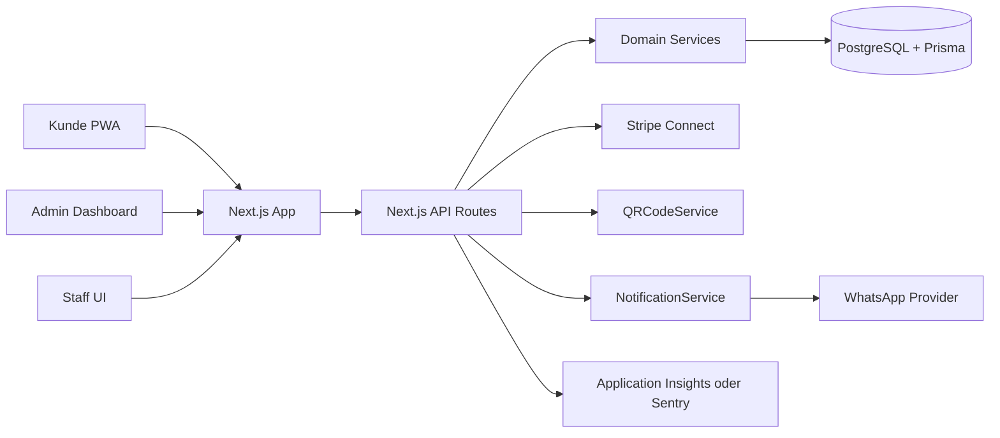

# Spargelstand-App Technisches Konzept

**Dokumenttyp:** Technisches MVP-Konzept  
**Zielgruppe:** Product Engineering, Softwarearchitektur, Entwicklung und technisches Projektmanagement  
**Stand:** 22. Mai 2026

## Kurzfassung

Die Spargelstand-App wird als Next.js Web-App/PWA mit TypeScript umgesetzt. Eine Codebase bedient Kunden, Spargelbauer/Admins und Stand-Mitarbeiter. Die serverseitige Domainlogik liegt in klar getrennten Services. PostgreSQL mit Prisma ist die zentrale Datenbank, Stripe Connect übernimmt Payment und Produzentenauszahlung, QRToken sichern die Abholung. Ein Notification Service ergänzt E-Mail und optionale WhatsApp Order Updates.

Der technische Kern ist die Inventory Engine. Sie verhindert Überbuchungen, indem sie reservierte Mengen blockiert und erst bei Abholung final vom Bestand abzieht.

## Zielarchitektur



Im DOCX wird dieses Diagramm als vereinfachter Architekturfluss dargestellt:

```text
Next.js PWA
-> API Routes / Route Handlers
-> Domain Services
-> PostgreSQL + Prisma
-> Stripe Connect, QRToken, Notification Service, Monitoring
```

## Technologieentscheidungen

| Baustein | Entscheidung | Begründung |
| --- | --- | --- |
| Frontend | Next.js PWA | Eine Anwendung für Kunde, Admin und Mitarbeiter |
| Sprache | TypeScript | Sichere Statuswerte und typisierte API |
| Backend | Next.js API Routes als modularer Monolith | Schnell und ausreichend für MVP |
| Datenbank | PostgreSQL | Relationale Domäne mit Orders, Payments und Inventory |
| ORM | Prisma | Migrationen und typsichere Datenbankzugriffe |
| Geo-Suche | PostGIS oder Lat/Lng-Radius | Robuste Standortsuche mit einfachem Fallback |
| Auth | Auth.js oder Supabase Auth | Schnelle Integration mit serverseitigem RBAC |
| Payment | Stripe Connect | Plattformgebühr und Produzentenauszahlung |
| QR-Code | Serverseitige QRToken-Generierung | Sicherheit und One-Time-Use |
| Notification | E-Mail plus WhatsApp Provider | Transaktionale Bestellupdates und Abholerinnerungen |
| Hosting | Azure App Service | Bevorzugte Zielplattform mit Azure PostgreSQL und Monitoring |

Ein separates NestJS-Backend ist erst sinnvoll, wenn mehrere Teams, umfangreiche Integrationen oder externe Partner-APIs entstehen.

## Architekturprinzipien

| Prinzip | Umsetzung im MVP |
| --- | --- |
| Domainlogik serverseitig | Reservierung, Payment, QR und Inventory laufen in Services |
| Einfache Betriebsform | Modularer Monolith statt Microservices |
| Strikte Statusmodelle | Statuswechsel nur über Domain Services |
| Mandantentrennung | `producer_id` und `stand_id` werden serverseitig geprüft |
| Idempotenz | Webhooks und Pickup-Bestätigungen sind wiederholbar ohne Seiteneffekte |
| Nachvollziehbarkeit | InventoryEvent und Audit Logs dokumentieren kritische Änderungen |

Diese Prinzipien verhindern, dass die erste Version durch unnötige Architekturkomplexität gebremst wird, und sichern trotzdem die kritischen Garantieprozesse ab.

## Frontend-Struktur

Die Anwendung wird in drei Routenbereiche gegliedert.

| Bereich | Routen | Zweck |
| --- | --- | --- |
| Kunde | `/`, `/stands`, `/stands/[id]`, `/checkout/[orderId]`, `/orders/[orderId]/qr` | Suche, Reservierung, Zahlung, QR-Code |
| Admin | `/admin`, `/admin/stands`, `/admin/products`, `/admin/inventory`, `/admin/orders`, `/admin/delivery`, `/admin/revenue` | Operative Steuerung |
| Staff | `/staff`, `/staff/orders`, `/staff/scan`, `/staff/inventory`, `/staff/delivery` | Standbetrieb |

State Management bleibt schlank:

| State-Typ | Empfehlung |
| --- | --- |
| Serverdaten | React Server Components oder TanStack Query |
| Formulare | React Hook Form |
| Validierung | Zod Schemas |
| Auth-Session | Auth-Lösung plus serverseitige Guards |
| Tabellenfilter | URL Query Params |

## Backend-Module

| Service | Verantwortung |
| --- | --- |
| AuthService | Session, Rollen, Ressourcenbesitz |
| StandService | Standorte, Öffnungszeiten, Status, Geo-Suche |
| ProductService | Produkte, Preise, Sichtbarkeit |
| InventoryService | Bestand, Blockierung, Freigabe, Events |
| ReservationService | Orders, PickupSlots, Statusmodell, Storno |
| PaymentService | Stripe Checkout, Webhooks, Refunds, Service Fee |
| QRCodeService | QRToken, Hashing, Validierung, QR-Code |
| DeliveryPlanningService | Regelbasierte Lieferempfehlungen |
| NotificationService | E-Mail, WhatsApp, Order Events, Versandstatus und Fehlerlogs |

API-Handler bleiben dünn:

```text
Request validieren
-> Session laden
-> Rolle und Ressourcenbesitz prüfen
-> Service aufrufen
-> Fehler standardisieren
-> JSON Response zurückgeben
```

## Rollenrechte

Alle Rechte werden serverseitig geprüft. Clientseitige UI-Ausblendung ist nur Komfort.

| Funktion | Kunde | Spargelbauer/Admin | Stand-Mitarbeiter | Plattformadmin |
| --- | --- | --- | --- | --- |
| Stände suchen | Ja | Ja | Eingeschränkt | Ja |
| Reservierung erstellen | Eigene | Nein | Nein | Supportfall |
| Bestand ändern | Nein | Eigene Stände | Zugewiesene Stände | Alle |
| QR-Code scannen | Nein | Optional | Ja | Ja |
| Abholung bestätigen | Nein | Optional | Ja | Ja |
| Mitarbeiter verwalten | Nein | Eigene | Nein | Alle |
| Refund auslösen | Nein | Anfrage/optional | Nein | Ja |

Zentrale Sicherheitsregel: Jede Admin-Query filtert nach `producer_id`, jede Staff-Query nach zugewiesener `stand_id`, jede Customer-Order nach `customer_id`.

## Datenmodell-Zusammenfassung

| Entität | Zweck |
| --- | --- |
| User | Nutzer mit Rolle und optionalem Produzentenbezug |
| Producer | Landwirtschaftlicher Betrieb |
| Stand | Physischer Verkaufsstand mit Adresse und Koordinaten |
| Product | Produktkatalog des Produzenten |
| Inventory / StandProduct | Bestand eines Produkts an einem Stand |
| Order / Reservation | Reservierung mit Abholzeitfenster |
| OrderItem | Produktposition in einer Order |
| Payment | Payment Provider, Beträge, Status und Gebühren |
| QRToken | Signierter, gehashter Token für QR-Codes |
| InventoryEvent | Nachvollziehbare Bestandsänderung |
| PickupSlot | Buchbares Abholzeitfenster |
| DeliveryPlan | Geplante oder empfohlene Nachlieferung |
| Notification | Versandauftrag und Status für E-Mail, WhatsApp oder Push |
| NotificationPreference | Kanalpräferenzen und WhatsApp Opt-in/Opt-out |
| WhatsAppConversation | Optional für spätere eingehende WhatsApp-Nachrichten |

Wichtige Constraints:

| Constraint | Zweck |
| --- | --- |
| `Inventory(stand_id, product_id)` eindeutig | Ein Bestand je Produkt und Stand |
| Geldbeträge in Cent | Keine Rundungsfehler |
| Mengen als Decimal | kg, Schale und Bund abbildbar |
| Provider Event ID eindeutig | Idempotente Webhook-Verarbeitung |
| QRToken nur gehasht gespeichert | Token-Missbrauch begrenzen |
| Notification(provider_message_id) optional eindeutig | Idempotente Provider-Statusupdates |
| NotificationPreference(user_id, channel) eindeutig | Klare Kanalpräferenz je Nutzer |

## Transaktionsgrenzen

Die folgenden Vorgänge müssen atomar laufen, weil sie direkt Bestände, Zahlungen oder Abholungen betreffen.

| Vorgang | Transaktionale Änderungen |
| --- | --- |
| Reservierung erstellen | Inventory prüfen, `reserved_quantity` erhöhen, Order und OrderItems speichern |
| Payment Success | Payment `succeeded`, Order `confirmed`, QRToken erzeugen |
| Payment Failed oder Expiry | Payment/Order aktualisieren, reservierte Menge freigeben |
| Pickup bestätigen | QRToken nutzen, Order `picked_up`, Bestand reduzieren, InventoryEvent schreiben |
| Storno vor Pickup | Order beenden, reservierte Menge freigeben, optional Refund starten |

Bei parallelen Reservierungen wird die Inventory-Zeile gesperrt oder per optimistischem Update abgesichert. Entscheidend ist, dass `available_quantity` nie unter 0 gebucht wird.

## API-Design

Die REST-API liegt unter `/api/v1`.

| Gruppe | Beispiel-Endpunkte | Zugriff |
| --- | --- | --- |
| Customer API | `GET /stands`, `POST /orders`, `GET /orders/{id}/qr` | Kunde oder öffentlich |
| Admin API | `PATCH /admin/inventory/{standId}/{productId}`, `GET /admin/orders` | Spargelbauer/Admin |
| Staff API | `GET /staff/orders`, `POST /staff/scan`, `POST /staff/orders/{id}/pickup` | Stand-Mitarbeiter |
| Webhooks | `POST /webhooks/stripe`, `POST /webhooks/whatsapp/status` | Provider-Signatur |

Einheitliches Fehlerformat:

```json
{
  "error": {
    "code": "INSUFFICIENT_INVENTORY",
    "message": "Die gewünschte Menge ist nicht mehr verfügbar."
  }
}
```

Wichtige Fehlercodes sind `VALIDATION_ERROR`, `AUTH_REQUIRED`, `FORBIDDEN`, `NOT_FOUND`, `INSUFFICIENT_INVENTORY`, `INVALID_STATUS_TRANSITION`, `QR_TOKEN_ALREADY_USED`, `RESERVATION_EXPIRED` und `RATE_LIMITED`.

Zusätzliche Notification-Endpunkte:

| Gruppe | Endpunkte |
| --- | --- |
| Customer | `PATCH /me/notification-preferences`, `POST /me/phone/verify/start`, `POST /me/phone/verify/confirm`, `GET /orders/{id}/notifications` |
| Admin | `GET /admin/orders/{id}/notifications`, `POST /admin/orders/{id}/notify`, `GET /admin/notifications`, `GET /admin/notifications/failed` |
| Webhooks | `POST /webhooks/whatsapp`, `POST /webhooks/whatsapp/status` |

## Reservierung, Zahlung und Abholung

End-to-End-Prozess:

```text
Kunde wählt Stand, Produkt, Menge und Zeitfenster
-> Backend prüft Bestand
-> Inventory Engine blockiert Menge
-> Order wird pending_payment
-> Stripe Checkout startet
-> Stripe Webhook meldet Erfolg
-> Order wird confirmed
-> QRToken wird erzeugt
-> Notification Service versendet bei Opt-in WhatsApp-Bestätigung
-> Abholerinnerung wird geplant
-> Kunde zeigt QR-Code am Stand
-> Mitarbeiter scannt QR-Code
-> Backend validiert Token und Order
-> Mitarbeiter bestätigt Abholung
-> Order wird picked_up
-> Bestand wird final reduziert
```

## Statusmodelle

| Objekt | Erlaubte Statuswerte |
| --- | --- |
| Order | `draft`, `pending_payment`, `confirmed`, `ready_for_pickup`, `picked_up`, `cancelled`, `expired`, `refunded` |
| Payment | `pending`, `succeeded`, `failed`, `refunded` |
| Inventory | `available`, `low_stock`, `out_of_stock`, `next_delivery_expected` |
| Stand | `open`, `closed`, `seasonal_pause` |
| Notification | `pending`, `sent`, `delivered`, `failed`, `cancelled` |

Statuswechsel erfolgen ausschließlich über Domain Services, nicht direkt aus UI oder API-Handlern.

## Inventory Engine

Die Inventory Engine ist für die Reservierungsgarantie verantwortlich.

```text
available_quantity = stock_quantity - reserved_quantity - safety_buffer
```

| Ereignis | stock_quantity | reserved_quantity |
| --- | --- | --- |
| Order `pending_payment` | unverändert | wird erhöht |
| Payment `failed` | unverändert | wird reduziert |
| Order `expired` | unverändert | wird reduziert |
| Order `confirmed` | unverändert | bleibt blockiert |
| Order `picked_up` | wird reduziert | wird reduziert |
| Order `cancelled` vor Pickup | unverändert | wird reduziert |

Reservierung und Bestandsblockierung müssen in einer Datenbanktransaktion laufen. Parallele Reservierungen dürfen keinen negativen Bestand erzeugen.

## QRToken-Sicherheitskonzept

Bestell-QR-Codes enthalten keine Kundendaten und keine Produktdetails. Sie enthalten nur eine Token-URL.

```text
https://app.example.com/pickup/scan?token=<signed-token>
```

| Sicherheitsanforderung | Umsetzung |
| --- | --- |
| Nicht erratbar | Zufälliger Token mit hoher Entropie |
| Signiert | Server-seitige HMAC-Signatur |
| Gehasht gespeichert | Kein Klartext-Token in der Datenbank |
| Ablaufend | Nach Abholfenster plus Kulanzzeit |
| One-Time-Use | `used_at` und Status `used` |
| Standgebunden | Staff darf nur eigene Stand-Orders bestätigen |

WhatsApp-Nachrichten enthalten nur einen sicheren Link zur Bestellung oder QR-Code-Seite. Dieser Link darf keinen unsicheren QRToken-Klartext enthalten und muss über eine authentifizierte Session oder einen separaten, signierten und zeitlich begrenzten Zugriffstoken geschützt sein.

## Payment und Webhooks

Stripe Connect ist primärer Payment Provider. Die Plattformgebühr wird über die Service Fee beziehungsweise Application Fee abgebildet.

Webhook-Regeln:

| Regel | Umsetzung |
| --- | --- |
| Signaturprüfung | Stripe-Signatur mit Raw Body prüfen |
| Idempotenz | Provider Event ID eindeutig speichern |
| Statusvalidierung | Keine blinden Statusüberschreibungen |
| Fehlertransparenz | Fehler loggen und Monitoring alarmieren |
| Retry-Fähigkeit | Wiederholte Webhooks sind unschädlich |

Payment `succeeded` bestätigt die Order und erzeugt den QRToken. Payment `failed` oder Checkout-Timeout gibt die blockierte Menge frei.

## Security und Compliance

MVP-Mindestmaßnahmen:

| Thema | Maßnahme |
| --- | --- |
| DSGVO | Datensparsamkeit, Datenschutzerklärung, Aufbewahrungsregeln |
| Zahlungsdaten | Keine Karten- oder Wallet-Daten speichern |
| RBAC | Serverseitige Rollen- und Scope-Prüfung |
| QRToken | Signatur, Hash, Ablauf, One-Time-Use |
| Rate Limiting | Login, Order, Scan und Webhooks schützen |
| Audit Logs | Bestand, Pickup, Refunds und Rollenänderungen protokollieren |
| Secrets | Azure Key Vault oder App Service Configuration |
| WhatsApp Opt-in | Einwilligung, Opt-out und Telefonnummer datensparsam verarbeiten |

## Monitoring und operative Alarme

Für den Pilot sind wenige, aber konkrete Alarme wichtiger als ein großes Observability-Setup.

| Signal | Alarmbedingung |
| --- | --- |
| Payment Webhook Errors | Jeder fehlgeschlagene Webhook wird gemeldet |
| QR-Scan-Fehlerrate | Auffälliger Anstieg während Öffnungszeiten |
| Datenbankverbindung | Sofort bei Ausfall |
| Cronjob Expiry | Alarm nach zwei verpassten Läufen |
| Payment `pending` | Order länger als 15 Minuten offen |
| Inventory-Konflikt | Wiederholte Concurrency-Konflikte |
| Notification-Fehler | Auffällige Fehlerrate bei E-Mail oder WhatsApp |
| WhatsApp Provider | Delivery-Status- und Template-Fehler sichtbar machen |

Logs dürfen keine QRToken im Klartext, keine Zahlungsdaten, keine vollständigen Telefonnummern und keine unnötigen personenbezogenen Daten enthalten.

## DevOps und Deployment

Bevorzugtes Azure-Setup:

| Baustein | Azure-Dienst |
| --- | --- |
| Web/API | Azure App Service Node.js |
| Datenbank | Azure Database for PostgreSQL Flexible Server |
| Secrets | Azure Key Vault oder App Service Configuration |
| Monitoring | Application Insights |
| Storage | Azure Blob Storage für spätere Assets/Exports |
| Scheduler | Azure WebJobs, Azure Functions Timer oder Container Job |

CI/CD Pipeline:

```text
Install
-> Lint
-> Typecheck
-> Unit Tests
-> Integration Tests
-> Build
-> Migration Check
-> Deploy Staging
-> manuelle Production-Freigabe
```

## Testing

| Testbereich | Kernfälle |
| --- | --- |
| Unit Tests | Inventory-Formel, Statusmodelle, QRToken, Fee-Berechnung |
| Integration Tests | Order-Erstellung, Payment Webhook, Pickup, Bestandsevents |
| E2E Tests | Kunde reserviert, bezahlt und holt per QR ab |
| Webhook Tests | Signatur, Idempotenz, Success, Failed, Refund |
| QR Tests | Ungültig, abgelaufen, bereits verwendet, falscher Stand |
| Notification Tests | Opt-in, Template-Auswahl, Versandstatus, WhatsApp Webhook |
| Concurrency Tests | Zwei parallele Reservierungen für letzte Menge |
| RBAC Tests | Fremde Orders, fremde Stände, Staff-Scope |

## Technische Abnahmekriterien

| Bereich | Kriterium |
| --- | --- |
| Build | Typecheck, Tests und Next.js Build laufen erfolgreich |
| Datenbank | Prisma-Migrationen sind reproduzierbar |
| Reservierung | Bestand wird während Checkout blockiert |
| Payment | Stripe Webhook ist signiert und idempotent |
| QR | Token ist signiert, gehasht, ablaufend und One-Time-Use |
| Pickup | Doppelte Abholung ist technisch ausgeschlossen |
| RBAC | Kunde, Admin, Staff und Plattformadmin sind getrennt |
| Cronjobs | Abgelaufene Reservierungen geben Bestand frei |
| Monitoring | Payment-, QR- und DB-Fehler werden sichtbar |
| Datenschutz | Keine Zahlungsdaten oder Klartext-Tokens werden gespeichert |
| WhatsApp | Opt-in/Opt-out, sichere QR-Links und Notification Logs funktionieren |

## Sprint 1 und Sprint 2

Sprint 1 Ziel:

```text
Ein Admin kann Basisdaten vorbereiten,
ein Kunde kann Stände und Produkte sehen,
und die technische Grundlage für Reservierungen steht.
```

Sprint 1 Tasks:

| Task | Ergebnis |
| --- | --- |
| Next.js/TypeScript Setup | Lauffähige App |
| Prisma/PostgreSQL Setup | Migrationen und Client |
| Basisdatenmodell | User, Producer, Stand, Product, Inventory |
| Auth und Rollen | Login und Guards |
| Public Stand API | Stände suchen |
| Produktliste je Stand | Verfügbarkeit anzeigen |
| Admin Basislayout | Geschützter Admin-Bereich |

Sprint 2 Ziel:

```text
Ein Kunde kann Ware mit Menge und Zeitfenster reservieren,
das System blockiert Bestand korrekt,
und abgelaufene Reservierungen geben Bestand wieder frei.
```

Sprint 2 Tasks:

| Task | Ergebnis |
| --- | --- |
| Order, OrderItem, PickupSlot | Datenmodell für Reservierung |
| InventoryService | Verfügbare Menge berechnen |
| Transaktionale Prüfung | Keine Überbuchung |
| Temporäre Blockierung | `reserved_quantity` korrekt erhöhen |
| Customer Reservierungsformular | Menge und Zeitfenster |
| Admin Bestandsverwaltung | Bestand manuell pflegen |
| Expiry Cronjob | Abgelaufene Reservierungen freigeben |

## Zusammenfassung

Die technische Umsetzung bleibt bewusst kompakt: Next.js, TypeScript, PostgreSQL, Prisma, Stripe Connect, QRToken, Notification Service und Azure App Service reichen für einen echten MVP-Pilot aus. Entscheidend ist nicht eine große Enterprise-Architektur, sondern eine robuste Bestands- und Statuslogik, die die Reservierungsgarantie tatsächlich erfüllt. WhatsApp ergänzt diesen Flow als optionaler P1-Benachrichtigungskanal, ersetzt aber im MVP keine App/PWA-Funktion.
